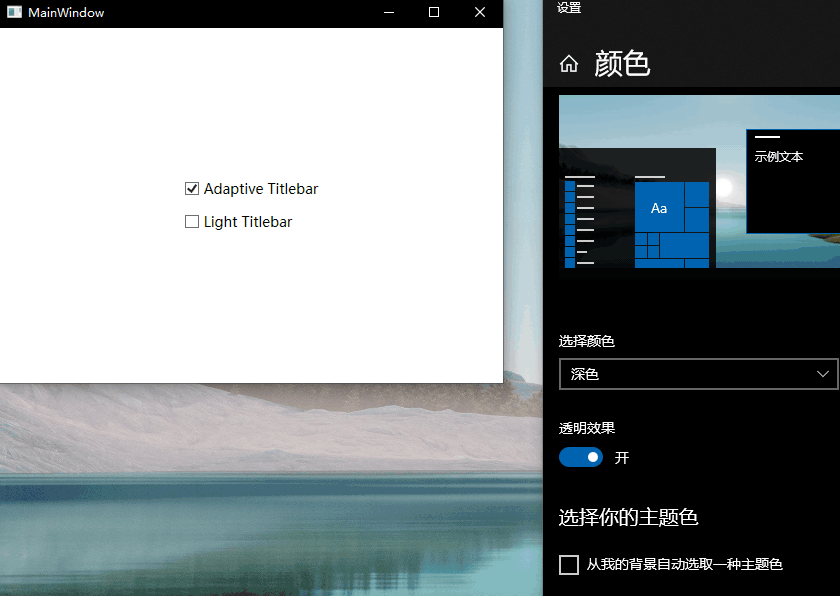

# TitlebarAdaptive.WPF

[中文](#中文) | [English](#english)

---

## 中文

`TitlebarAdaptive.WPF` 是一个用于 WPF 的标题栏主题适配辅助库，可以让窗口标题栏跟随 Windows 系统的浅色/深色模式自动切换，也支持手动指定标题栏颜色。


### 特性

- 自动跟随系统主题变化
- 支持手动设置标题栏浅色/深色
- 适用于 WPF 窗口
- 支持多目标框架：
  - .NET Framework 4.6.2
  - .NET Framework 4.8
  - .NET 8
  - .NET 10
- 可打包为 NuGet 库发布

### 安装方式

#### 方法 1：通过 NuGet 包管理器安装

在 Visual Studio 中打开 `NuGet 包管理器`，搜索并安装：

`TitlebarAdaptive.WPF`

#### 方法 2：通过包管理器控制台安装

```powershell
Install-Package TitlebarAdaptive.WPF
```

#### 方法 3：通过 .NET CLI 安装

```powershell
dotnet add package TitlebarAdaptive.WPF
```

### 使用方式

在窗口上启用自适应标题栏：

```xml
<Window
    ...
    xmlns:wpf="clr-namespace:TitlebarAdaptive.WPF;assembly=TitlebarAdaptive.WPF"
    wpf:OriginalWindowHelper.Adaptive="True" />
```

手动指定标题栏颜色：

```xml
<Window
    ...
    xmlns:wpf="clr-namespace:TitlebarAdaptive.WPF;assembly=TitlebarAdaptive.WPF"
    wpf:OriginalWindowHelper.Adaptive="False"
    wpf:OriginalWindowHelper.TitleBarIsLight="True" />
```

### 属性说明

- `Adaptive="True"`：自动跟随系统主题
- `Adaptive="False"`：关闭自动适配，使用手动设置
- `TitleBarIsLight="True"`：浅色标题栏
- `TitleBarIsLight="False"`：深色标题栏
- `TitleBarIsLight="null"`：不指定标题栏颜色


### 项目结构

- `TitlebarAdaptive.WPF`：核心库
- `TitlebarAdaptive.Demo`：演示程序

---

## English

`TitlebarAdaptive.WPF` is a WPF helper library for title bar theme adaptation. It can automatically switch the window title bar between light and dark modes based on the Windows system theme, and it also supports manually setting the title bar color.

### Features

- Automatically follows system theme changes
- Supports manual light/dark title bar settings
- Designed for WPF windows
- Multi-target support:
  - .NET Framework 4.6.2
  - .NET Framework 4.8
  - .NET 8
  - .NET 10
- Can be packed and published as a NuGet package

### Installation

#### Method 1: Install via NuGet Package Manager

In Visual Studio, open `NuGet Package Manager` and install:

`TitlebarAdaptive.WPF`

#### Method 2: Install via Package Manager Console

```powershell
Install-Package TitlebarAdaptive.WPF
```

#### Method 3: Install via .NET CLI

```powershell
dotnet add package TitlebarAdaptive.WPF
```

### Usage

Enable adaptive title bar on a window:

```xml
<Window
    ...
    xmlns:wpf="clr-namespace:TitlebarAdaptive.WPF;assembly=TitlebarAdaptive.WPF"
    wpf:OriginalWindowHelper.Adaptive="True" />
```

Set the title bar color manually:

```xml
<Window
    ...
    xmlns:wpf="clr-namespace:TitlebarAdaptive.WPF;assembly=TitlebarAdaptive.WPF"
    wpf:OriginalWindowHelper.Adaptive="False"
    wpf:OriginalWindowHelper.TitleBarIsLight="True" />
```

### Property details

- `Adaptive="True"`: follow the system theme automatically
- `Adaptive="False"`: disable adaptive mode and use manual settings
- `TitleBarIsLight="True"`: light title bar
- `TitleBarIsLight="False"`: dark title bar
- `TitleBarIsLight="null"`: do not specify a title bar color

### Project layout

- `TitlebarAdaptive.WPF`: core library
- `TitlebarAdaptive.Demo`: demo application
